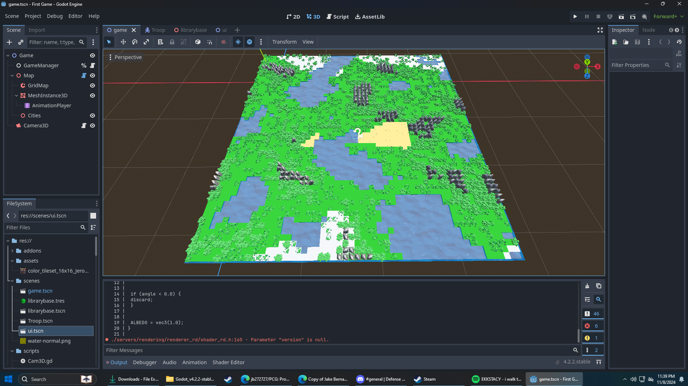
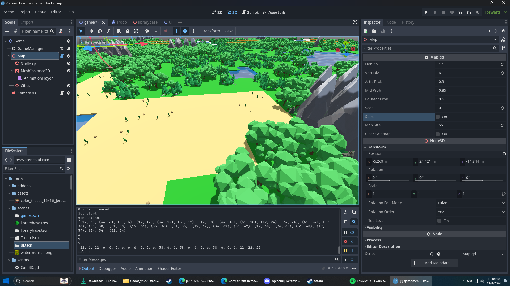

# PCG Test Game
Procedurally Generated Map for a strategy 4X game made in the Godot Engine. Fully customizable size, biome variation, biome region reach, biome rarity, etc.
Uses a curated heightmap for mountain and water generation based on map size.

# Preview of customization settings and close-up

